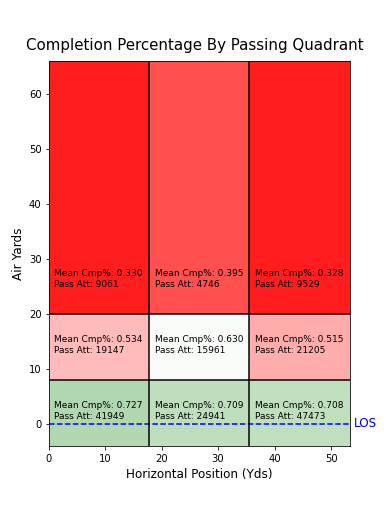
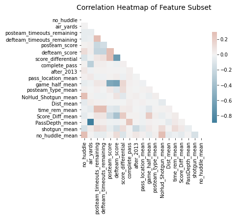
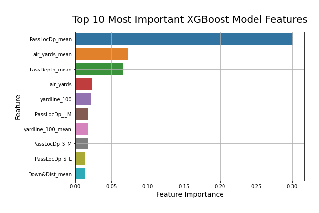

# [Expected Fantasy Points](https://github.com/willmscaleb/Personal-Data-Projects/tree/main/NFL%20Expected%20Fantasy%20Points) Part 1: Completion Probability

## Overview
* Created completion probability models using limited situational input data achieving improved log-loss error over univariate baseline models.
* Optimized logistic regression, stochastic gradient descent, k-nearest neighbors, and xgboost classifiers hyperparameters with bayesian optimization through hyperopt.
* Transformed the model output into the following two outputs:
    * Expected fantasy points for a target not including yards after catch (YAC);
    * Expected fantasy points for a pass attempt not including YAC.
    
## Code and Resources Used
* **Python version:** 3.7
* **Packages:** pandas, numpy, scipy, sklearn, matplotlib, seaborn, xgboost, time
* **Data:** [nflfastR](https://github.com/guga31bb/nflfastR-data)
* **For web framework requirements:** in progress (will add soon)

## EDA and Preprocessing
The main steps I followed for exploratory data analysis and data preprocessing can be summarized as:
* Dropped all irrelevant and non-opportunity associated columns,
* Dropped all non-pass attempt data points and pass-attempts with incosnsistencies such as air yards and yards after catch not summing up to yards gained,
* Binned and combined certain features that I suspected could hold valuable information (based on my football knowledge),
* Plotted completion and incompletion distributions of all features, as well as a passing grid heatmap of completion percentage,
* Based on observations from the plots, I engineered more features and cleaned up the data a little more,
* Mean encoded categorical features as well as some continuous/semi-continuous numeric features and plotted histograms of each,
* Plotted a correlation heatmap and defined a collinear cleaning function that drops all collinear features (based on a correlation coefficient threshold) except  the one that is most highly correlated to the target variable (this function was specifically used for the linear models),
* Defined and plotted a log-loss scoring baseline model for comparison.
* Conducted yeo-johnson transformations of continuous/semi-continuous features for the linear models and plotted the results

Below is a summary of my data visualizations.

  

## Modeling

### Algorithms
From my EDA, I knew that there were only a few features with any significant correlation to completion percentage. I therefore expected that linear models such as logistic regression or stochastic gradient descent could provide an effective solution. However, these models could have difficulty given the non-normal distributions and semi-continuous nature of some of the input variable distributions. So I thought it prudent to include some non-linear models that would likely better deal with these non-normal input variables adn could account for other potential non-linearities. In the end, I chose to test the following scikit-learn algorithms:
* LogisticRegression
* SGDClassifier
* KNeighborsClassifier
* XGBoostClassifier

### Baseline Models
Since I am interested in the probability of the outcome, I used log-loss scoring. For my 1st baseline model, I used a constant prediction probability of the mean completion percentage of the train dataset (illustrated in the plot below). I also came up with a second better baseline model that was a univariate model that used the feature PassLocDp to predict the mean probability base on the pass grid location (as plotted in the exploratory data analysis). The resulting log-loss achieved by these baselines respectively was 0.662986 and 0.627003.

### Hyperparameter Tuning

Instead of using the well known gid search or randomized search algorithms for hyperparameter tuning, I prefer to use the more efficient Bayesian Optimization method through the hyperopt package. To do so, I defined an objective function for the hyperopt fmin function (minimizes the objective function over a defined parameter space). My objective function had the following features:
* 3 fold stratified cross validation
* Log-loss scoring of every fold as well as the mean of the 3 folds
* Capability to choose correct algorithm model pipeline based on input parameter space
* Included feature scaling via StandardScaler and feature selection via SelectKBest in pipelines for appropriate models
* Times fmin function run time

### Test Set Performance

 Model                       | Log-Loss Score 
 :---------------------------|:---------------
 eXtreme Gradient Boosting   | 0.601049        
 Logistic Regression         | 0.606708 
 Stochastic Gradient Descent | 0.607464
 K-Nearest Neighbors         | 0.624625 
 Pass Grid Baseline          | 0.627003 
 Mean Cmp% Baseline          | 0.662986 

In the end, all of the tested algorithms outperformed both the baseline models, but not by a huge margin. This small margin of outperformance is not surprising considering input data was restricted to opportunity related metrics and did not include any skill related metrics. Football is also a highly random sport and predictions can rarely be made with significant accuracy. 

The XGBoost model was the winner on a scoring basis, but logistic regression provides a much simpler, faster and more interpretable solution that scored only slightly worse. Since, computational time isn't very important to me to minimize in this project (provided it isn't extremely long), I chose to proceed with the XGBoost model.

For reference, below is a plot of the XGBoost model's top 10 most important features. As you can see, the model is very heavily weighted towards metrics describing depth of target, horizontal location of target, and field position.

## Output Sample
