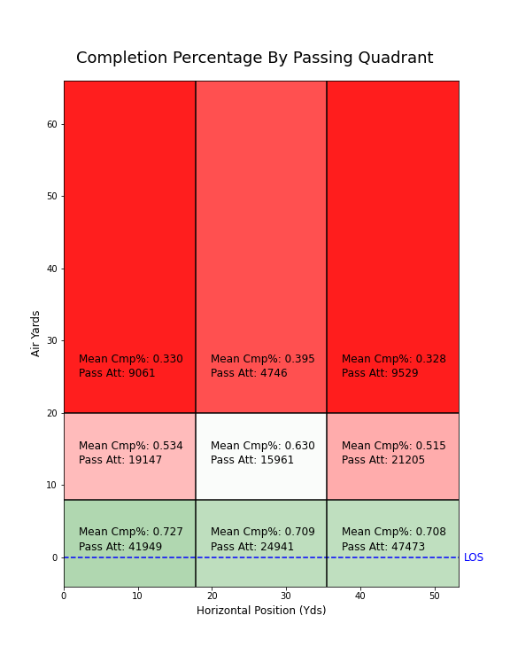
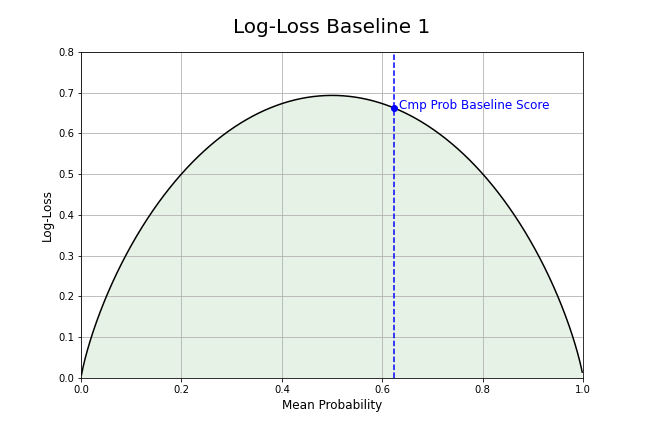

# [Expected Fantasy Points](https://github.com/willmscaleb/Personal-Data-Projects/tree/main/NFL%20Expected%20Fantasy%20Points) Part 1: Completion Probability

## Overview
* Created completion probability models using limited situational input data achieving improved log-loss error over univariate baseline models.
* Optimized logistic regression, stochastic gradient descent, k-nearest neighbors, and xgboost classifiers hyperparameters with bayesian optimization through hyperopt.
* Transformed the model output into the following two outputs:
    * Expected fantasy points for a target not including yards after catch (YAC);
    * Expected fantasy points for a pass attempt not including YAC.
    
## Code and Resources Used
* **Python version:** 3.7
* **Packages:** pandas, numpy, scipy, sklearn, matplotlib, seaborn, xgboost, time
* **Data:** [nflfastR](https://github.com/guga31bb/nflfastR-data)
* **For web framework requirements:** in progress (will add soon)

## Exploratory Data Analysis

## Modeling

### Algorithms
From my EDA, I knew that there were only a few features with any significant correlation to completion percentage. I therefore expected that linear models such as logistic regression or stochastic gradient descent could provide an effective solution. However, these models could have difficulty given the non-normal distributions and semi-continuous nature of some of the input variable distributions. So I thought it prudent to include some non-linear models that would likely better deal with these non-normal input variables adn could account for other potential non-linearities. In the end, I chose to test the following scikit-learn algorithms:
* LogisticRegression
* SGDClassifier
* KNeighborsClassifier
* XGBoostClassifier

### Baseline Models
Since I am interested in the probability of the outcome, I used log-loss scoring. For my 1st baseline model, I used a constant prediction probability of the mean completion percentage of the train dataset (illustrated in the plot below). I also came up with a second better baseline model that was a univariate model that used the feature PassLocDp to predict the mean probability base on the pass grid location (as plotted in the exploratory data analysis). The resulting log-loss achieved by these baselines respectively was 0.662986 and 0.627003.

### Hyperparameter Tuning

Add plots showing improvement iteration by iteration.

### Test Set Performance

## Output Sample
