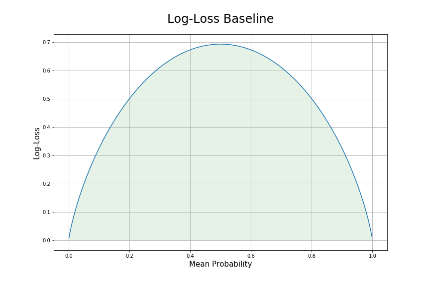

# NFL Expected Fantasy Points

## Introduction

In fantasy football there is a well known saying that "volume is king". In other words, when analyzing players, the most important thing to consider is the opportunity they receive, not the efficiency (or skill) of said player. Expected fantasy points is a metric meant to capture the value of a player's opportunity. 

The concept was first introduced by Mike Clay from ESPN. He calls it OFP for opportunity adjusted fantasy points and describes it as what an average player would most likely score given the workload. 

So, what's the difference between my model and Mike Clay's? Well, first of all, you can't access Mike Clay's numbers without a subscription to ESPN+ and if you're like me, you want your metrics free (other expected fantasy points models are also not freely available). Secondly, it isn't public knowledge what his model considers and how it works, so you just have to take his numbers at face value without truly understanding what they're specifically telling you. Thirdly, Mike Clay has discussed one shortfall of his metric (I listen to an ESPN podcast he frequently speaks on) - that the per play expected points totals are always additive regardless of whether or not they should be. For example, a RB could get 4 carries in a row from the 1 yardline and fail on them all. His OFP would then be much higher than 6.1, despite this being the theoretical maximum number of points the RB could have scored since his model adds all expected points per play independently. My model fixes this issue.

## Approach

### Data
Since the goal of this project is to most accurately predict what an average fantasy player would score given his opportunity, I excluded any features that would introduce player/team skill into the model such as player name, player team, and opponent team.

### Modeling
Instead of making a single model to predict play by play fantasy points scored, I decomposed the problem into several sub-problems in order to more easily determine and predict patterns unique to each sub-problem. So this project has 6 models that make up the overall expected points model. They are:
1. [Completion Probability](https://github.com/willmscaleb/Personal-Data-Projects/tree/main/NFL%20Expected%20Fantasy%20Points/Completion%20Probability%20Model): when a pass is attempted, what is the probability it is completed?
2. Expected Yards After Catch 1: when a pass is completed, how many yards after the catch will the receiver accumulate?
3. Touchdown Probability 1: 
    1. Pass Attempts: when a pass is attempted, what is the probability it ends in an offensive touchdown?
    2. Rush Attempts: when a run is attempted, what is the probability it ends in an offensive touchdown?
4. Expected Rushing Yards 1: when a run is attempted, how many yards will the runningback accumulate?
5. Fumble Lost Probabilty 1: when a pass is completed, a run is attempted or a quarterback is sacked, what is the likelihood that the ball carrier loses a fumble? 
6. Interception Probability 1: when a pass is attempted, what is the probability it ends in an interception?

### Scoring
For the probability models, since they are binary classification problems where the probability of the outcome is what is important, I use log-loss scoring. For these models, a usefule baseline that I used is to simply set the mean of the train set dependent variable as your predicted probability. The resulting log-loss from this baseline model is described by the plot below.

For the yards regression models, a proper scoring method is not as simple. Since the dependent variable is right skewed and a natural maximum is present (a runner can only gain a maximum of the number of yards left until the goalline and a minimum of the opposite), transforming it to be sufficiently normally distributed in order to effectively utilize mean squared or mean abslute error scoring is not possible. As a result, using such scoring methods will cause the model to favor higher yardage predictions than would otherwise be expected (since after log transforming there a right skew remains). To counteract this overly positive bias, I used a quantile scorer with a gamma greater than 0.75. This scoring method penalizes negative error much more than positive error and thus counteracts the models' positive bias when using symetrical loss functions. I also tuned gamma through choosing the gamma that ensures that the total loss associated with positive error equals the total loss associated with negative error for the case where the prediction is equal to the mean of the dependent variable.

## Results

The test set scoring results by model are as follows:

 Model             | Scoring Type               | Baseline Score | Model Score 
 :-----------------|:---------------------------|:---------------|:------------
 Completions       | Log-Loss                   | 0.6630         | 0.6013        
 Yards After Catch | Quantile (&gamma; = )      | in progress    | in progress 
 Pass TDs          | Log-Loss                   | in progress    | in progress 
 Rush TDs          | Log-Loss                   | in progress    | in progress 
 Rushing Yards     | Quantile (&gamma; = )      | in progress    | in progress 
 Fumble Losts      | Log-Loss                   | in progress    | in progress 
 Interceptions     | Log-Loss                   | in progress    | in progress 

Once all the models are complete, I will combine their predictions into a complete expected fantasy points per play model for 3 common scoring systems: standard scoring, half ppr (points per reception) scoring, and full ppr scoring. I will then group the play by play expected points by player and game to get a list of game by game expected points by player for the entire dataset (since 2009). To do this I will first sum up all a players expected fantasy points (not including points from receptions) by drive and take the minimum of this value and the maximum possible points (excluding receptions) the player could accumulate on that drive given the yardline at which his first attempt or target occured. For example, on play 3 of a drive player A gets targetted while his team 80 yards from the endzone. His maximum possible expected points from this drive excluding receptions is now 14 (8 for potential yardage, 6 for potential touchdown). Say player A is targetted 5 more times this drive and has a total drive expected fantasy points of 18, I would then take the 14 points as his expected total since 18 points would have actually been an impossibility and only arrived because of failure to capitalize on his expectation (except in the case where there were negative yardage plays during the drive, but this discrepancy will be small and rare).

In the end, the real measure of the usefullness of this expected points model will be in examining how predictive it of future player fantasy points. Specifically, is it a more useful metric than actual fantasy point achieved in terms of 

## Areas to Improve

Some of the more notable areas of potential improvement:
* Trying neural network algorithms
* Getting access to and using frame by frame player coordinate data (a more recent NFL innovation)
* Trying various new features, especially bins of various features. I would like to make a function that can bin continuous/semi-continuous variables specifically so that when the bins are then mean encoded, the mean encoded version follows a relatively normal distribution
* Automating weekly updates of expected points for all active NFL players every week and creating up to date leaderboard visualizations.

1 : Model is currently in development
